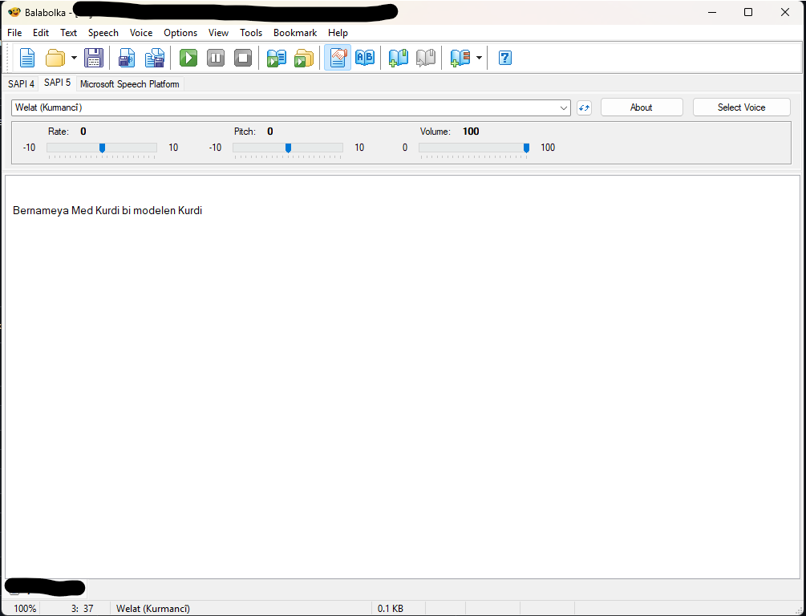

# MED Kurdî TTS - Xwendina Kurdî

**Çevrimdışı Kürtçe (Kurmancî) Metin Okuma Uygulaması**

Modern, karanlık temaya sahip bir masaüstü uygulaması. Piper ONNX modelleri kullanarak Kürtçe metni doğal konuşmaya dönüştürür.

## Özellikler ✨

- 🎙️ **Kurdî TTS Sentez** - Piper ONNX modelleri ile yüksek kaliteli ses sentezi (Reşad, Roj, Welat)
- 🌙 **Modern Tema** - Şık, koyu tema ile göz yormayan arayüz
- 📁 **Dinamik Model Yönetimi** - Models klasöründen otomatik model taraması
- 🔄 **Kolay Model Ekleme** - Kullanıcılar yeni modelleri kolayca ekleyebilir
- ⚙️ **Gelişmiş Ses Kontrolü** - Hız, tonlama ve uzunluk ayarları
- 💾 **Çoklu Format Desteği** - WAV ve MP3 olarak ses dosyası dışa aktarma
- 📋 **Kürtçe Metin İşleme** - Kısaltma genişletme ve sayı-metne dönüştürme

## İndirme ve Kurulum 🚀

### Windows 🪟

**Yöntem 1: Installer (Önerilen)**
1. `MED_Kurdi_v1_Setup.exe` dosyasını indirin.
2. Kurulum sihirbazını çalıştırın.
3. Başlat Menüsünden uygulamayı açın.

### macOS 🍎

**Yöntem 1: Installer (PKG)**
1. `MEDKurdi_Installer_Universal.pkg` dosyasını indirin.
2. Yönergeleri izleyerek kurulumu tamamlayın.

**Yöntem 2: ZIP (Portable)**
- **Apple Silicon (M1/M2/M3):** `MEDKurdi_Mac_Arm64.zip` dosyasını indirin ve çıkarın.
- **Intel Mac:** `MEDKurdi_Mac_Intel.zip` dosyasını indirin ve çıkarın.

- 

*Not: macOS'ta uygulamayı ilk kez açarken "Geliştirici doğrulanamadı" uyarısı alırsanız, Sistem Ayarları > Gizlilik ve Güvenlik bölümünden izin vermeniz gerekebilir.*

## Sistem Gereksinimleri

- **Windows:** Windows 10/11 (64-bit)
- **macOS:** macOS 11.0 (Big Sur) veya üzeri
- **RAM:** Minimum 4GB (8GB önerilir)
- **Disk Alanı:** ~500MB

## Lisans

Bu proje MIT Lisansı altında lisanslanmıştır. Detaylar için `LICENSE` dosyasına bakınız.

---

**Her Bijî Kurdî! 🎙️✨**
