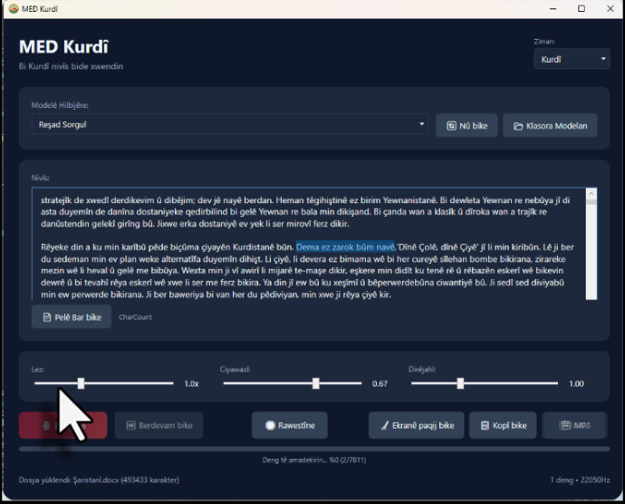
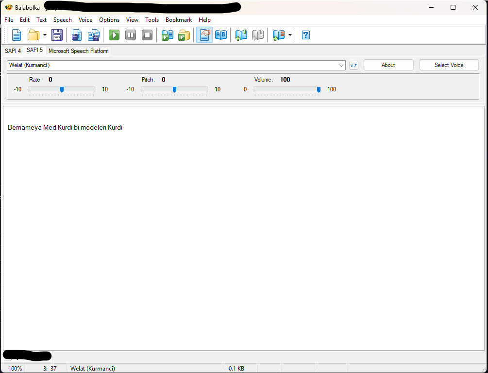

# MED Kurdî TTS - Xwendina Kurdî

**Sepana xwendina nivîsê ya Kurdî (Kurmancî) ya bê internet**

Ev sepaneke sermaseyê ya nûjen e bi temaya tarî. Bi modelên Piper ONNX nivîsa Kurdî dike dengê xwezayî.

## Taybetmendî ✨

- 🎙️ **Senteza Kurdî TTS** - Senteza dengê bi kalîteya bilind bi modelên Piper ONNX (Reşad, Roj, Welat)
- 🌙 **Tema ya Nûjen** - Rûkarê şık û tarî ku çavan nayêwestîne
- 📁 **Rêveberiya Modela Dînamîk** - Lêgerîna otomatîk a modelan ji peldanka Models
- 🔄 **Zêdekirina Modelê bi Hêsanî** - Bikarhêner dikarin modelên nû bi hêsanî zêde bikin
- ⚙️ **Kontrola Pêşketî ya Dengê** - Mîhengên lez, ton û dirêjahî
- 💾 **Piştgiriya Gelek Formatan** - Derxistina pelên dengî wekî WAV û MP3
- 📋 **Pêvajoya Nivîsa Kurdî** - Firehkirina kurtkirinan û veguherandina jimarê bo nivîsê

## Daxistin û Sazkirin 🚀

### Windows 🪟

**Rêbaz 1: Installer (Pêşniyarkirî)**
1. Pela `MED_Kurdi_v1_Setup.exe` daxînin.
2. Sêrbaza sazkirinê bimeşînin.
3. Sepanê ji Menuya Destpêkê vekin.

### macOS 🍎

**Rêbaz 1: Installer (PKG)**
1. Pela `MEDKurdi_Installer_Universal.pkg` daxînin.
2. Bi şopandina rêberan sazkirinê temam bikin.

**Rêbaz 2: ZIP (Portable)**
- **Apple Silicon (M1/M2/M3):** Pela `MEDKurdi_Mac_Arm64.zip` daxînin û derxînin.
- **Intel Mac:** Pela `MEDKurdi_Mac_Intel.zip` daxînin û derxînin.

- 

*Têbînî: Ger hûn di macOS de dema yekem de sepanê veke û hişyariya "Pêşdebir nayê piştrastkirin" bibînin, dibe ku pêdivî be ku ji Beşê Mîhengên Pergalê > Taybetî û Ewlehî destûr bidin.*

## Pêdiviyên Pergalê

- **Windows:** Windows 10/11 (64-bit)
- **macOS:** macOS 11.0 (Big Sur) an jî bilindtir
- **RAM:** Kêmînin 4GB (8GB tê pêşniyarkirin)
- **Cihê Dîskê:** ~500MB

## Lîsans

Ev proje li bin Lîsansa MIT hatiye lîsanskirin. Ji bo hûrguliyan pelê `LICENSE` bibînin.

---

**Her Bijî Kurdî! 🎙️✨**
